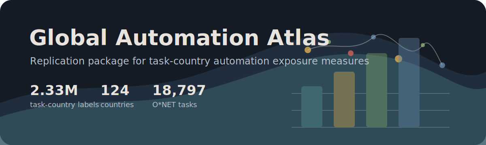

# Global Automation Atlas

Public replication package for **Global Automation Atlas** by Prashant Garg, Tommaso Crosta, and Jasmin Baier.

<p>
  <a href="https://automationatlas.org/">Atlas website</a> |
  <a href="https://automationatlas.org/paper/">Paper</a> |
  <a href="https://automationatlas.org/data/">Data downloads</a>
</p>



This repository contains the retained labels, analysis panels, prompt protocols, source-data files, and R scripts used to check the paper results. The measurement object is a task-country dataset: 18,797 O*NET tasks evaluated across 124 country contexts, producing 2,330,776 retained task-country observations.

## Quick start

Check that the expected files are present:

```bash
Rscript code/check_replication_package.R
```

Run the reproduction workflow:

```bash
Rscript code/make_all.R
```

The workflow writes rebuilt outputs to `reproduced/` and runs a numeric audit of paper-presented values. At this package build, the audit checks 53 rounded claims, including country exposure ranges, validation correlations, gender-gap summaries, and fixed-effect coefficients.

## Main files

| Path | Contents |
| --- | --- |
| `data_intermediate/task_country_labels_analysis.parquet` | Retained task-country labels used in the paper analyses. |
| `data_intermediate/task_metadata.csv` | O*NET task identifiers and task statements. |
| `data_intermediate/country_metadata.csv` | Country identifiers, regions, income groups, and weighting metadata. |
| `data_intermediate/country_occupation_panel.parquet` | Country-occupation exposure summaries. |
| `data_intermediate/country_industry_panel.parquet` | Country-industry exposure summaries. |
| `data_analysis/` | Smaller panels used directly in figures, tables, and checks. |
| `outputs/source_data/` | Compact source data behind paper and supplementary figures and tables. |
| `outputs/figures/` and `outputs/tables/` | Final figure and table files used in the manuscript. |
| `prompts/` | Country-conditioned, income-group, and context-free labelling protocols. |
| `docs/data_dictionary/` | Column descriptions and inferred types for the main public data files. |

`manifest.csv` lists all files in the package with byte sizes.

## What is reproduced

`code/make_all.R` rebuilds selected figures and tables from the included source data and records figure status in `reproduced/checks/figure_reproduction_status.csv`. Rebuilt figures check the underlying numbers; they are not intended to be pixel-identical to the designed manuscript figures.

The language-model labelling step is documented but not rerun. That stage depends on external API access and model availability, so the package starts from the retained labels used in the paper.

## Data sources

The analysis uses public source data from O*NET, the World Bank, Penn World Table, Barro-Lee, Worldwide Governance Indicators, CEPII BACI, ILOSTAT, the IMF AI Preparedness Index, Eurostat, and external exposure measures cited in the paper. Source links and roles are listed in `data_raw_public_metadata/source_inventory.csv`.

## Requirements

The reproduction scripts are written in R and use `arrow`, `dplyr`, `readr`, `tidyr`, `ggplot2`, and `scales`. No API keys are needed.

## Citation

If you use this package, please cite the paper. Citation metadata are provided in `CITATION.cff`. The current paper version is available at [automationatlas.org/paper](https://automationatlas.org/paper/).

## Licence and third-party data terms

Code is released under the MIT License; see `LICENSE`. Constructed data files combine original measures with cleaned extracts or derived variables from public third-party sources. Those source datasets retain their own terms. See `docs/DATA_USE_NOTICE.md` for source-specific notes and attribution guidance.
