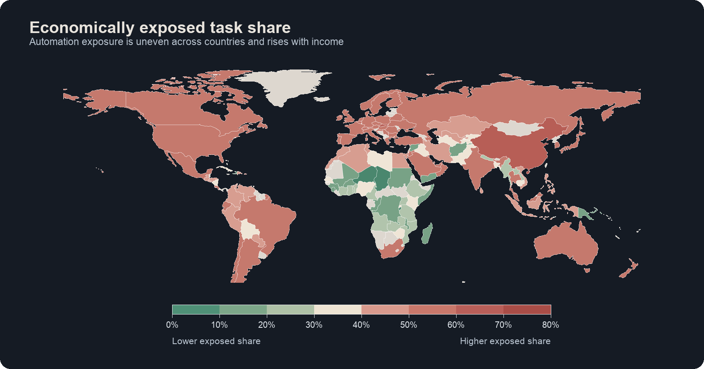

# Global Automation Atlas

Public replication package for Global Automation Atlas by Prashant Garg, Tommaso Crosta, and Jasmin Baier.

<p>
  <a href="https://automationatlas.org/">Atlas website</a> |
  <a href="https://automationatlas.org/paper/">Paper</a> |
  <a href="https://automationatlas.org/data/">Data downloads</a>
</p>



This repository contains retained analysis data, source-data extracts, and code for checking the results reported in the paper. It starts from the retained task-country labels and rebuilds downstream numerical checks, tables, and figures. Exact submitted versions are retained as reference snapshots, while the manifest distinguishes direct builds from numerical or source-data check renders.

The package does not include exploratory drafts, old figure variants, raw API logs, or the full language-model rationale corpus. For the rationale-concept analysis reported in the paper, it includes compact source-data tables for the fixed concepts, discovery scores, concept-fidelity scores, and heldout paired estimates for exposure, substitution-only, and augmentation-only contrasts.

## Quick start

From the package root, first check that the expected files are present:

```bash
Rscript code/check_replication_package.R
```

Then run the reproduction workflow:

```bash
Rscript code/make_all.R
```

If the Python requirements are installed in a virtual environment, point the workflow to it with, for example, `PYTHON=.venv/bin/python Rscript code/make_all.R`.

The workflow writes rebuilt files to `reproduced/`. It also runs a numeric audit of paper-presented values. If any audited number fails to match after rounding, the script stops and points to `reproduced/checks/numeric_claim_audit.csv`.

## What the scripts check

- `code/check_replication_package.R` checks the core inventory and prints row counts for the task-country label file.
- `code/make_all.R` rebuilds summary tables and selected figures from the included data.
- `code/04_numeric_audit.R` checks headline values reported in the paper, including country exposure ranges, validation correlations, gender-gap summaries, and fixed-effect coefficients.
- `code/05_rationale_concept_audit.R` checks the HypotheSAEs discovery, fidelity, and heldout paired-estimator fields for all three paper-facing contrasts.
- `code/06_refresh_audit.R` writes `manifest.csv`, mapping each active manuscript asset and reported statistic to its public reproduction check, package artifact, source data, and checksum where applicable.
- `code/manuscript_figures/build_fixed_concept_appendix_figures.py` directly rebuilds the three 20-concept HypotheSAEs appendix figures from the released 60-row discovery/fidelity/heldout table.
- `code/manuscript_figures/build_combined_rf_rationale_main_figure.py` directly rebuilds current Figure 6 from the released five-seed TreeSHAP/ALE and pooled-rationale tables.
- `code/manuscript_figures/build_openai_observed_use_iwa_validation.py` rebuilds the observed-use validation from the public OpenAI Signals files, O*NET task hierarchy, and retained U.S. task labels.
- `code/manuscript_figures/build_current_check_renders.py` writes current numerical/source-data checks, including the five-seed direction audit and gender/informality panels.
- `docs/figure_asset_registry.csv` is the authoritative 40-active-figure mapping. `reproduced/checks/figure_reproduction_status.csv` validates it against the manuscript snapshot.

At the time of this package build, the numeric audit checks 59 rounded paper values.

## Folder guide

- `prompts/` contains the country-conditioned, income-group, and context-free prompt protocols, plus model notes.
- `data_intermediate/` contains the retained measurement outputs used downstream. The central file is `task_country_labels_analysis.parquet`, with 2,330,776 task-country observations across 124 countries and 18,797 tasks.
- `data_analysis/` contains smaller panels used directly in the country, channel, predictor, occupation, industry, and gender analyses.
- `outputs/source_data/` contains source data for paper and supplementary figures and tables where a compact source file is available.
- `outputs/source_data/rationale_concepts/` contains the current 60-concept discovery, fidelity, and heldout estimates, the 18 pooled families shown in Figure 6, the place-mask vocabulary, and source data for the illustrative examples table.
- `outputs/figures/` and `outputs/tables/` contain exact reference snapshots of the active manuscript artifacts. Their capture and original production provenance are documented in `docs/provenance/REFRESH_PROVENANCE.md`; they are never substituted for a rebuilt result without that distinction being explicit.
- `reproduced/` is created by `code/make_all.R` and contains rebuilt checks, tables, and figures.
- `docs/data_dictionary/` gives column descriptions and types for the main public data files.
- `data_raw_public_metadata/source_inventory.csv` lists public source datasets and links.

## Language-model labelling step

The package documents the language-model labelling protocol but does not rerun it. The API stage depends on model availability, model versions, and paid external services. For reproducibility, the package supplies the retained labels used in the paper and the prompts needed to inspect the measurement protocol.

The prompt files are:

- `prompts/country_conditioned_prompt.md`
- `prompts/income_group_prompt.md`
- `prompts/context_free_prompt.md`
- `prompts/model_config.json`

The retained label file excludes the full rationale text. It keeps only the columns needed for the paper analyses: exposure level, labour margin, channel, AI materiality, AI function, country identifiers, and task identifiers. The compact rationale-concept source bundle in `outputs/source_data/rationale_concepts/` documents the subset of rationale-derived results reported in the paper without releasing raw API logs or the full rationale corpus.

## Data dictionaries

The main dictionary is `docs/data_dictionary/schema_with_descriptions.csv`. It reports file names, column names, inferred column types, and descriptions for the main files in `data_intermediate/` and `data_analysis/`. A shorter hand-written dictionary is also available at `docs/data_dictionary/data_dictionary.csv`.

## Figure and table reproduction

The package distinguishes three figure reproduction classes.

First, `outputs/figures/` contains the exact figure files used by the paper. These files are included so that readers can recover the submitted visual evidence exactly.

Second, `exact_reproducible_build` figures are generated by package-relative adaptations of the original plotting scripts. The three fixed-concept figures, combined Figure 6, and OpenAI observed-use alignment are checked against the active snapshots at 150 dpi; PDF byte hashes can differ because regenerated files carry different metadata and font-object encodings.

Third, `numerical_source_data_check_render` figures reproduce the values from released source data while allowing expected differences in layout, cartography, typography, or composition.

The same logic applies to tables. Final manuscript table files are in `outputs/tables/`; rebuilt check tables are in `reproduced/tables/`. The corrected common-cell-normalized gender fixed-effect table is rebuilt from `outputs/source_data/ilostat_gender/gender_fe_table_current.csv`. The gender-gap decomposition figure and its reported component means are checked from the two released files in `outputs/source_data/ilostat_gender/`.

## Data sources

The analysis uses public source data from O*NET, the World Bank, Penn World Table, Barro-Lee, Worldwide Governance Indicators, CEPII BACI, ILOSTAT, the IMF AI Preparedness Index, Eurostat, and external exposure measures cited in the paper. The file `data_raw_public_metadata/source_inventory.csv` lists source links and roles in the analysis.

## Requirements

The reproduction scripts use R and Python. R dependencies are `arrow`, `dplyr`, `readr`, `tidyr`, `ggplot2`, and `scales`; Python dependencies are listed in `code/requirements.txt`. Poppler's `pdftoppm` is used for the rendered-pixel comparison. No API keys are needed.

### Software checklist details

The package provides source code rather than compiled standalone software. It includes the retained task-country labels, compact analysis panels, and source-data files needed to demo and reproduce the reported checks.

Tested environment:

- macOS 26.1
- R 4.5.3
- `arrow` 23.0.1.2
- `dplyr` 1.2.1
- `readr` 2.2.0
- `tidyr` 1.3.2
- `ggplot2` 4.0.2
- `scales` 1.4.0

No non-standard hardware is required. A normal desktop or laptop is sufficient. No API keys are required for the public reproduction workflow.

To install the required R packages, run:

```r
install.packages(c("arrow", "dplyr", "readr", "tidyr", "ggplot2", "scales"))
```

```bash
python3 -m pip install -r code/requirements.txt
```

Typical install time on a normal desktop computer is under 10 minutes when binary packages are available, but can be longer if `arrow` must be compiled from source.

To run the demo inventory check:

```bash
Rscript code/check_replication_package.R
```

Expected output reports the number of task-country labels, figures, tables, and retained rationale concepts. This check normally runs in under one minute.

To reproduce the included tables, selected figures, and numerical audits:

```bash
Rscript code/make_all.R
```

Expected output is written to `reproduced/`, including rebuilt tables, selected rebuilt figures, `reproduced/checks/numeric_claim_audit.csv`, `reproduced/checks/figure_reproduction_status.csv`, and `reproduced/checks/rationale_hypothesaes_audit.csv`. On a recent desktop, the workflow usually runs in a few minutes.

## Known limits

The package is designed to reproduce the paper results from retained labels, not to repeat the original API labelling run. Raw language-model rationales, API batches, embeddings, and restricted third-party microdata remain outside the package.

## Citation

If you use this package, please cite the paper. Citation metadata are provided in `CITATION.cff`. The current paper version is available at [automationatlas.org/paper](https://automationatlas.org/paper/).

## Licence and third-party data terms

The code in this package is released under the MIT License; see `LICENSE`. The data files combine original constructed measures with cleaned extracts or derived variables from public third-party sources. Those source datasets remain governed by their own terms. See `docs/DATA_USE_NOTICE.md` for source-specific notes and attribution guidance.
